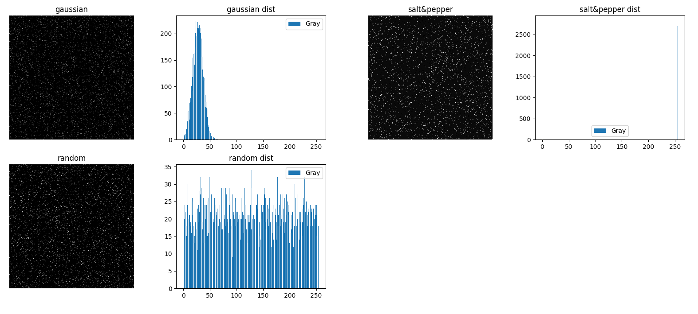
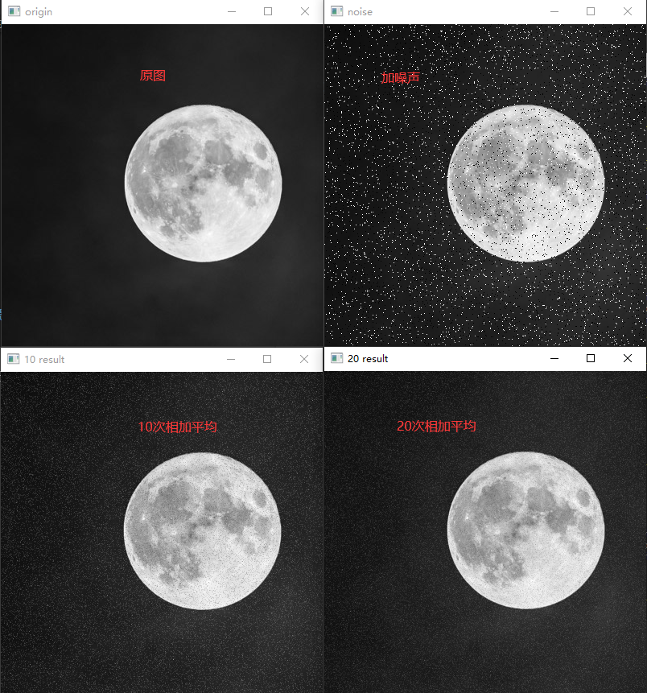
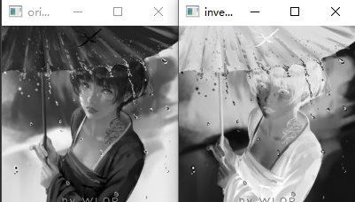
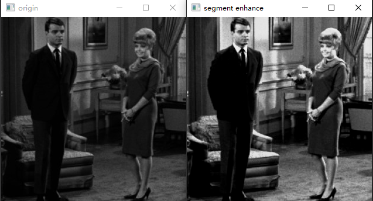
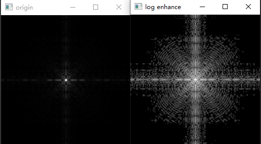
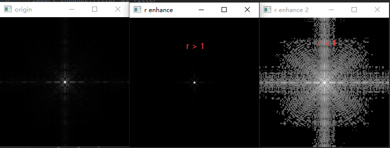
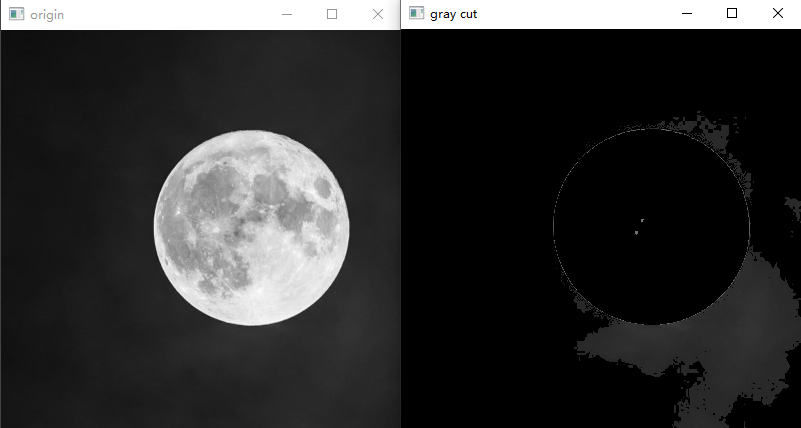
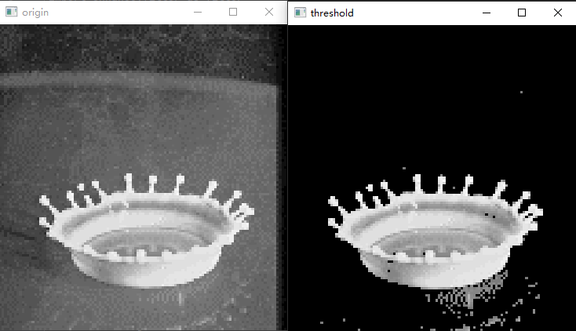
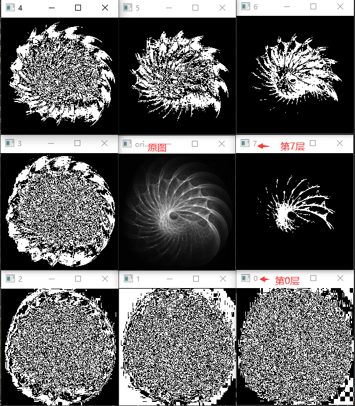
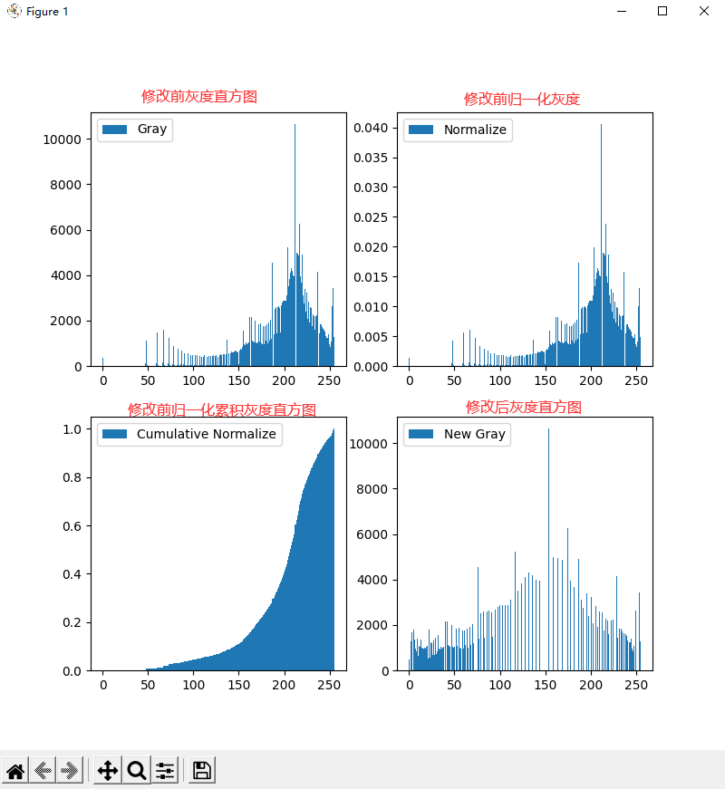

#### 数字图像处理的一些总结
#### 1. 空间域增强
- 相加平均
- 灰度映射
- 直方图均衡化
- 线性滤波
- 非线性滤波

#### 2. 傅里叶变换频域增强
- 低通（平滑）滤波
- 高通（锐化）滤波

#### 3. 图像复原
- 退化函数
- 逆滤波
- 维纳滤波

#### 4. 图片缩放
- 最近邻
- 双线性
- 双三次

#### 5. 边缘检测
- 普通滤波
- Marr-Hildreth
- Canny

#### 6.形态学
- 腐蚀 膨胀
- 开 闭

### 声明：此项目里的实现很多是自己写的，如增强部分，全是按像素卷积的实现，并没有效率，旨在实现背后的思想。

#### 1.前置
> 按一定统计规律生成一些噪声，用于对图像进行加噪干扰

#### 2.相加平均
> 多个噪声图片相加平均

#### 3.取反

#### 4.分段增强
> 用此分段函数，对图片进行分段增强

> 增强后的结果

#### 5.对数变换

#### 6.幂律变换

#### 7.灰度切割

#### 8.阈值

#### 9.位图切割

#### 10.直方图均衡化
> 修改前后的照片

> 修改前后的直方图

